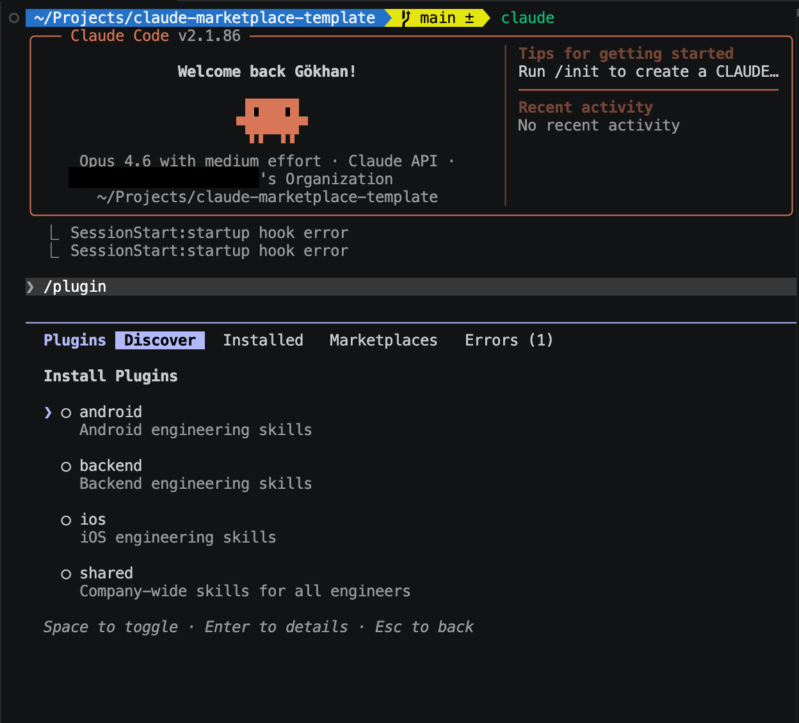

# Claude Marketplace Template

A template for building a shared AI context library for your engineering team. Fork this repo, rename the plugins for your org, and add your first skill.



## Structure

```
your-company/claude-marketplace
├── .claude-plugin/
│   └── marketplace.json        # Marketplace catalog
└── plugins/
    ├── shared/                  # Skills for all engineers
    │   └── skills/
    │       ├── pr-review/       # PR review checklist
    │       └── incident/        # Incident response guide
    ├── ios/                     # iOS engineering skills
    │   └── skills/
    │       ├── swiftui-review/  # SwiftUI code review
    │       └── app-store-release/ # App Store checklist
    ├── android/                 # Android engineering skills
    └── backend/                 # Backend engineering skills
```

Each skill is a focused markdown file that tells Claude how to help with a specific task at your company.

## Setup

### 1. Fork and rename

Fork this repo. Replace `my-company-claude` in `.claude-plugin/marketplace.json` with your company's name.

### 2. Customize the skills

Each skill ends with a "Customize this skill" note. Edit the checklists to reflect your actual conventions — the PR process your team follows, the architecture patterns you use, the mistakes that have burned you before.

### 3. Add the marketplace to a shared repo

In any repo your team clones, add to `.claude/settings.json`:

```json
{
  "extraKnownMarketplaces": {
    "my-company-claude": {
      "source": {
        "source": "github",
        "repo": "your-company/claude-marketplace"
      }
    }
  },
  "enabledPlugins": {
    "shared@my-company-claude": true
  }
}
```

Engineers clone the repo, get prompted to install the marketplace, pick their domain plugins, and from that point skills are available across every repo they work in.

### 4. Keep skills up to date automatically

Add this to `~/.claude/settings.json` to pull the latest skills on every session:

```json
{
  "hooks": {
    "UserPromptSubmit": [
      {
        "hooks": [
          {
            "type": "command",
            "command": "git -C ~/your-company-claude-marketplace pull --quiet 2>/dev/null || true"
          }
        ]
      }
    ]
  }
}
```

### 5. Enterprise: push to everyone automatically

In the Claude.ai admin console under **Admin Settings > Claude Code > Managed settings**, add:

```json
{
  "enabledPlugins": {
    "shared@my-company-claude": true,
    "ios@my-company-claude": true
  }
}
```

Skills are pushed to every user in the org. No installation required.

## Adding a new skill

1. Create a directory under the relevant plugin: `plugins/shared/skills/my-skill/`
2. Add a `SKILL.md` file with a frontmatter `description`
3. Write the skill as instructions for Claude — what to ask for, what to check, what to produce
4. Commit and push. Engineers pick it up on their next session.

## Rule of thumb

If you explain something to Claude twice, it belongs in a skill.

---

Related article: [How to build a shared AI context for your engineering team](https://medium.com/@gokhanamal/how-to-build-a-shared-ai-context-for-your-engineering-team-2a5a9c33ec83)
